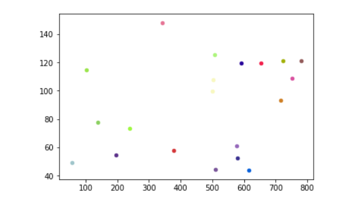
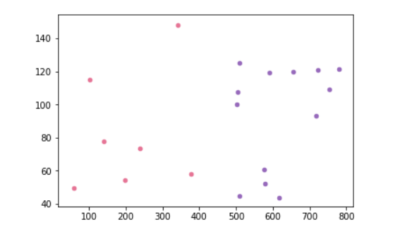
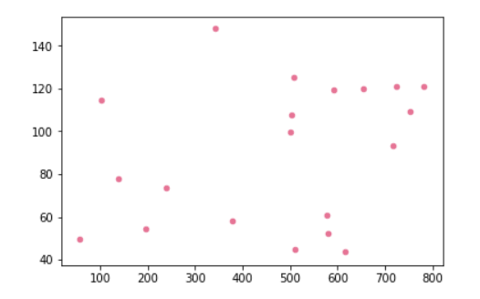
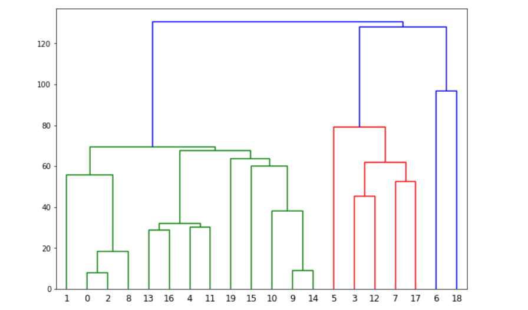

# Hierarchical-Agglomerative-Clustering
## It basically takes randomly 20 points from a file consisting of 8000 2D points and applies hierarchical agglomerative clustering algorithm on it. At each round it shows the status of the clusters by plotting it. Points with the same color belong to the same cluster. At the end it gives the dendrogram of the whole computation as the output. For n points the algorithm runs for n times.

## Some Screenshots of the output

## At initial stage all points correspond to a single cluster each

## At 2nd last stage only two clusters remains

## At the end only one cluster

## Final Dendrogram Output

